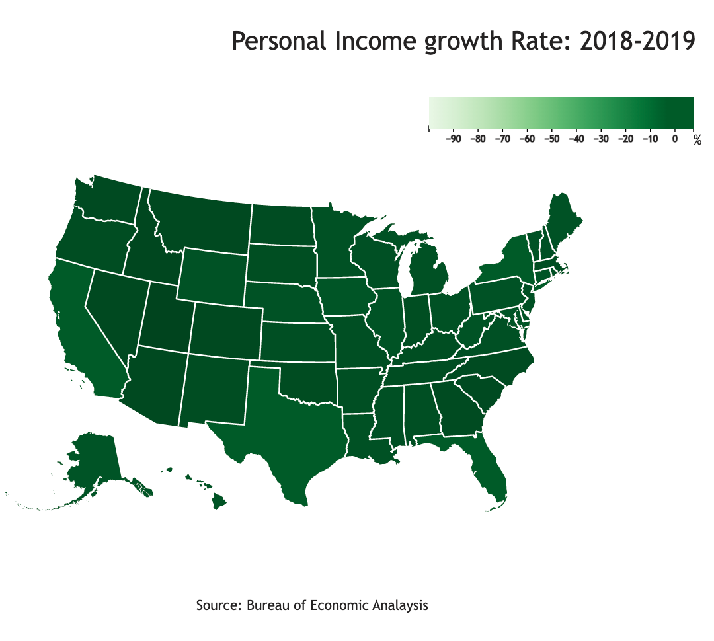

# DataViz-PersonalIncomeGrowth-2018-19
<!-- Description/ -->

## Chart type: Choropleth Map
<!-- Description/ -->

## Visualization
<!-- Description/ -->

Shows the percent growth in the income from 2018 to 2019 in each state.

## Data
<!-- Description/ -->

Data is from
- https://apps.bea.gov/api/data/?&UserID=39600B34-D659-47F4-BC6E-C59E7019B5A1&method=GetData&datasetname=Regional&TableName=CAINC1&LineCode=1&GeoFIPS=state&ResultFormat=json&Year=2018,2019

- Topology data - usTopo.json

## Data Manipulation - Javascript
<!-- Description/ -->

- Extracted Income data for years 2018 and 2019 from BEAAPI.Results.Data.DataValue field.  
- Merged these datasets - new object.
- Added 'growth'(% growth in the income in each state from 2018 to 2019) and 'STATEFP'(2 digit code for each state) fields to the new object.

- Added this object as an element to an empty array.
- Added the state data as another element from usTopo.json file to the same array.

